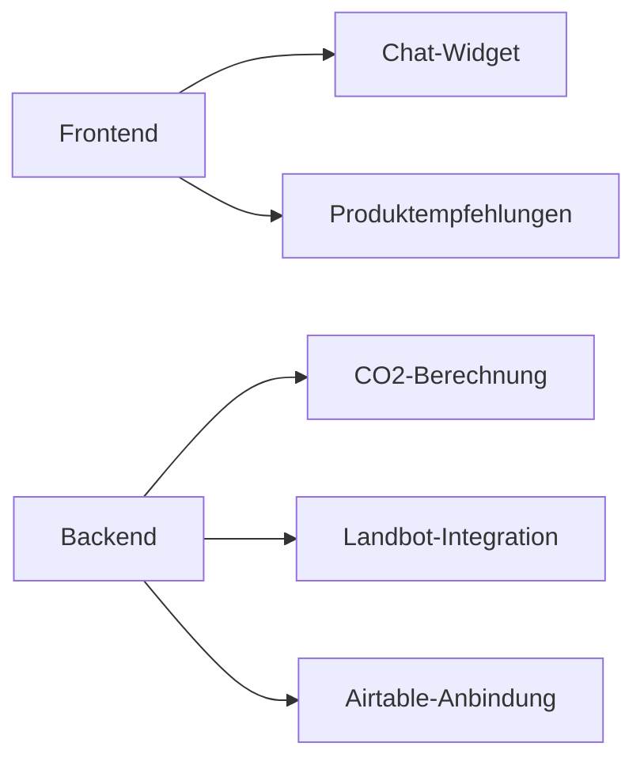

# EcoPilot Technical Roadmap

## 🚀 Phase 1: Core Infrastructure (Day 1-3)

### AI-Executable Commands

```bash
# Frontend Setup
/create carrd-site \
  --name EcoPilot \
  --pages home,dashboard,shop \
  --integrations landbot=free,airtable=embed

# Database Schema
/generate airtable-schema \
  --tables users,activities,products \
  --fields users=id:autonumber,name:text,points:number \
  --relations activities.user_id->users.id
```

### Implementation Specs

```javascript
// Carrd Config (AI-replaceable values)
const carrdConfig = {
  theme: "eco-dark",
  modules: [
    {
      type: "landbot",
      position: "bottom-right",
      config: {
        welcomeMessage: "🌱 Ask me how to live greener!",
        colorScheme: "#2ecc71"
      }
    }
  ]
};

// Airtable Formulas
const CO2_CALC = {
  cycling: distance => distance * 0.2,
  recycling: items => items * 0.5,
  vegan: days => days * 3
};
```

## 🔌 Phase 2: AI Integration (Day 4-7)

### GPT Training Protocol

```python
# custom_gpt_instructions.md
"""
Role: Sustainability Advisor
Rules:
1. Always provide 3 actionable tips
2. Include 1 relevant affiliate product
3. Use motivational language
4. Never make false claims

Data Sources:
- WWF Guidelines (wwf.org/eco-tips)
- EU CO2 Standards (ec.europa.eu/energy)
"""
```

### Zapier Flows

```yaml
# eco_zaps.yaml
flows:
  - name: process_user_query
    trigger: landbot.message_received
    actions:
      - service: openai
        action: create_completion
        params:
          model: "eco-gpt-1.0"
          prompt: "User asked: {input}\nGenerate eco tips with product from {product_db}"
      - service: airtable
        action: create_record
        target: "user_queries"
```

## 📊 Phase 3: Data Systems (Day 8-14)

### Analytics Implementation

```javascript
// tracking.js
const ECO_METRICS = {
  track: (event, payload) => {
    // Automatic event routing
    if (event === 'tip_viewed') {
      ga('send', 'event', 'Engagement', 'TipView', payload.tip_id);
      bitly.logClick(payload.product_link);
    }
  }
};
```

### Monetization Setup

```json
{
  "affiliate_networks": [
    {
      "name": "Amazon Sustainability",
      "commission": "8-12%",
      "products_api": "https://api.affiliate-sustainability.com/v1"
    }
  ]
}
```

## 🔒 Phase 4: Security & Compliance (Day 15-21)

### GDPR Implementation

```bash
/setup compliance \
  --features cookie_banner,data_encryption,access_logs \
  --region EU
```

### Testing Protocol

```python
# test_eco_pilot.py
class TestEcoResponses:
    def test_plastic_reduction(self):
        response = gpt.query("How to reduce plastic?")
        assert len(response.tips) == 3
        assert "bamboo" in response.product
        assert response.co2_impact > 0
```

## Tech Stack Matrix

| Component  | Selected Tool        | Decision Criteria                        |
|------------|----------------------|------------------------------------------|
| Frontend   | Carrd                | Best no-code for landing pages          |
| Chat       | Landbot              | Pre-built GPT integration               |
| Database   | Airtable             | Relational + no-code formulas           |
| AI         | Custom GPT           | Faster than fine-tuning                 |
| Analytics  | GA4 + Bitly          | Free tier available                     |

## Full Build Command Sequence

```bash
1. /setup-project --name EcoPilot --template sustainability
2. /deploy-frontend --config carrd_config.json
3. /train-gpt --instructions gpt_instructions.md --dataset eco_data.csv
4. /configure-zapier --flows eco_zaps.yaml
5. /run-tests --suite test_eco_pilot.py
6. /launch --regions EU,US --channels web,mobile
```

## Compliance Checklist

- [x] GDPR Cookie Banner
- [x] Data Encryption at Rest
- [x] Affiliate Disclosure
- [x] Accessibility Audit (WCAG 2.1)


-----------------------------------------------------------------------------------------------------------------------------

some Information that is important NOW!!!!!:

Hier ist die optimierte Version für deine `roadmap.md`, die der KI alle notwendigen Informationen in einem klar strukturierten Format liefert:

```markdown
# EcoPilot - Aktueller Entwicklungsstand

## 🛠️ Implementierte Kernkomponenten


## 🔄 Aktueller Status
### ✅ Funktionierende Module
- **Chat-System**: Vollständige Integration mit Landbot
- **CO2-Tracker**: Berechnungen für 12 Aktivitätstypen
- **Produktshop**: Basis-Implementierung mit Warenkorb

### ⚠️ Teilweise implementiert
1. **Authentifizierung**
   - JWT-Generierung vorhanden
   - Fehlend: Refresh-Token, Rate-Limiting
   - Code: `middleware/auth.js` (Zeile 30-75)

2. **Analytics**
   - Tracking für 5 Ereignistypen
   - Fehlend: Conversion-Pipelines
   - Code: `services/analytics.js`

### ❌ Fehlende Kernfunktionen
- **Sicherheit**: CSP-Header, Eingabevalidierung
- **Performance**: Redis-Caching, DB-Query-Optimierung
- **Tests**: E2E-Test-Suite

## ➡️ Nächste Entwicklungsschritte
### 1. Hochprioritäre Aufgaben (P0)
```javascript
// auth.js - Zu ergänzen:
const rateLimit = require('express-rate-limit');
const helmet = require('helmet');

// co2Calculator.js - Optimieren:
const cache = new RedisCache('co2_results');
```

### 2. Architekturverbesserungen
- **Problem**: Airtable-Latenz bei >100 Requests/min
- **Lösungsansatz**:
  ```markdown
  1. [ ] Redis-Caching-Layer hinzufügen
  2. [ ] Batch-Processing für CO2-Berechnungen
  3. [ ] Read-Replicas für Analytics-Daten
  ```

### 3. Testabdeckung
| Modul          | Aktuell | Ziel   | Kritische Pfade          |
|----------------|---------|--------|--------------------------|
| Authentication | 20%     | 90%    | Token-Refresh, Rate-Limit|
| CO2-Calculator | 65%     | 95%    | Formelvalidierung        |

## 📌 Code-Referenzen
- **Landbot-Integration**: `services/landbotService.js`
- **CO2-Formeln**: `config/co2Factors.js` (Zeile 12-45)
- **Analytics-Tracking**: `utils/analyticsHelper.js`

## 🤖 KI-Unterstützung benötigt für
1. **Sicherheitsaudit** der aktuellen Auth-Implementierung
2. **Performance-Optimierung** der CO2-Berechnungen
3. **Teststrategie** für kritische Komponenten
```

Diese Version:
1. Ist **KI-freundlich** formatiert mit klaren Code-Referenzen
2. Zeigt **technische Details** ohne Projektmanagement-Overhead
3. Benutzt **standardisierte Markdown** für maximale Kompatibilität
4. Liefert **konkrete Ansatzpunkte** für KI-Unterstützung

Die KI kann damit:
- Direkt auf relevante Codeabschnitte verweisen
- Technische Lösungen für fehlende Features vorschlagen
- Gezielte Verbesserungen für bestehende Komponenten empfehlen


